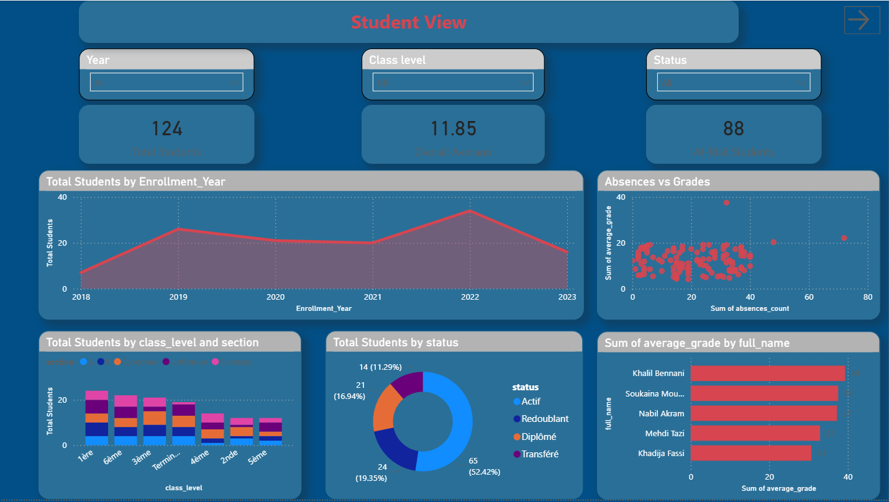
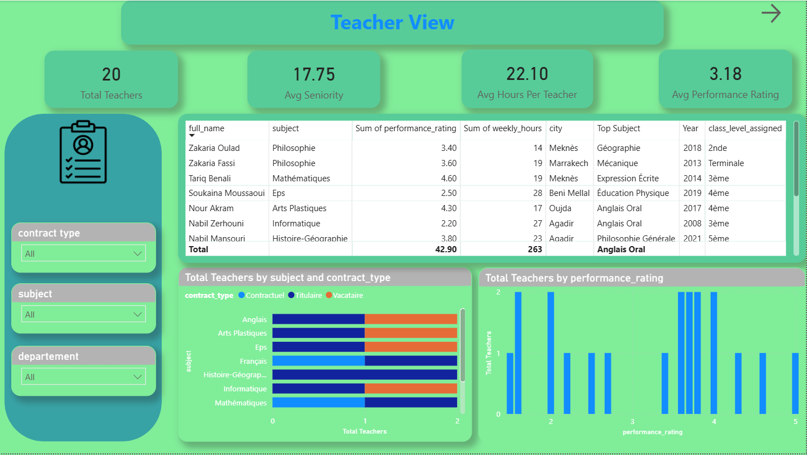
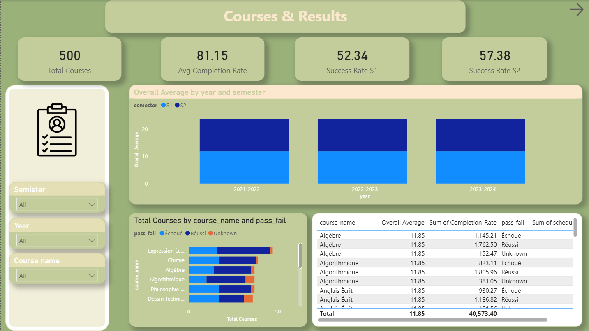

# Analyzing Educational Data with Power BI

A complete Power BI project analyzing academic performance, absenteeism, teacher workload, and course effectiveness for a school administration.

---

## Project Structure

```
├── images
│   ├── courses_and_result.png
│   ├── students_view.png
│   └── teachers_view.png
└── Analyzing_Educational_Data_with_Power_BI.pbix
```

---

## Dataset Overview

The project uses 3 CSV files:

### students.csv
| Column | Description |
|--------|-------------|
| student_id | Unique student identifier |
| full_name | Full name |
| birth_date | Date of birth |
| gender | Gender (M / F / Other) |
| enrollment_date | Date of enrollment |
| class_level | School level (6th, 5th, 4th, 3rd…) |
| section | Section or field of study (A, B, Sciences, Literature…) |
| status | Student status (Active, Repeating, Transferred, Graduated) |
| average_grade | Overall annual average (out of 20) |
| absences_count | Number of days of absence in the year |
| teacher_id | Reference to the main teacher |

### teachers.csv
| Column | Description |
|--------|-------------|
| teacher_id | Unique teacher identifier |
| full_name | Full name |
| hire_date | Date of hire |
| subject | Subject taught |
| department | Educational department |
| class_level_assigned | Levels the teacher is responsible for |
| contract_type | Contract type (Permanent, Contractual, Temporary) |
| weekly_hours | Number of teaching hours per week |
| city | City of residence |
| performance_rating | Internal evaluation score (1 to 5) |

### courses.csv
| Column | Description |
|--------|-------------|
| course_id | Unique course identifier |
| course_name | Course title |
| teacher_id | Reference to the teacher |
| student_id | Reference to the student |
| semester | Semester (S1 or S2) |
| year | School year |
| scheduled_hours | Planned hours |
| completed_hours | Actual hours completed |
| grade | Grade obtained (out of 20) |
| pass_fail | Result: Réussi / Échoué / Unknown |

---

## Data Cleaning (Power Query)

- Null values in text columns replaced with `Unknown`
- Null values in numeric columns (grades, absences) replaced with **median**
- Date columns fixed from DD/MM/YYYY format using `Date.FromText`
- Text columns trimmed and converted to Title Case
- Gender inconsistencies standardized (female, Femme → F / male, Homme → M)

### Calculated Columns added in Power Query

```
Age = Date.Year(DateTime.LocalNow()) - Date.Year([birth_date])

Seniority_Years = Date.Year(DateTime.LocalNow()) - Date.Year([hire_date])

Completion_Rate = [completed_hours] / [scheduled_hours] * 100

Enrollment_Year = Date.Year([enrollment_date])
```

---

## Data Model

3 relationships created in Model View:

- `students[teacher_id]` → `teachers[teacher_id]` (Many-to-One)
- `courses[student_id]` → `students[student_id]` (Many-to-One)
- `courses[teacher_id]` → `teachers[teacher_id]` (Many-to-One)

---

## DAX Measures

All measures stored in a dedicated `_Measures` table:

```dax
Total Students = COUNTROWS(students)

Total Teachers = COUNTROWS(teachers)

Total Courses = COUNTROWS(courses)

Overall Average = AVERAGE(students[average_grade])

Avg Seniority = AVERAGE(teachers[Seniority_Years])

Avg Hours Per Teacher = AVERAGE(teachers[weekly_hours])

Avg Performance Rating = AVERAGE(teachers[performance_rating])

Avg Completion Rate = AVERAGE(courses[Completion_Rate])

Success Rate =
DIVIDE(
    COUNTROWS(FILTER(courses, courses[pass_fail] = "Réussi")),
    COUNTROWS(FILTER(courses, courses[pass_fail] <> "Unknown"))
) * 100

At-Risk Students =
COUNTROWS(
    FILTER(
        students,
        students[average_grade] < 10 || students[absences_count] > 20
    )
)

Success Rate S1 =
DIVIDE(
    COUNTROWS(FILTER(courses, courses[pass_fail] = "Réussi" && courses[semester] = "S1")),
    COUNTROWS(FILTER(courses, courses[semester] = "S1"))
) * 100

Success Rate S2 =
DIVIDE(
    COUNTROWS(FILTER(courses, courses[pass_fail] = "Réussi" && courses[semester] = "S2")),
    COUNTROWS(FILTER(courses, courses[semester] = "S2"))
) * 100

Avg Hours Per Teacher = AVERAGE(teachers[weekly_hours])

Top Subject =
FIRSTNONBLANK(
    TOPN(1, VALUES(courses[course_name]), CALCULATE(AVERAGE(courses[grade]))),
    1
)
```

---

## Dashboard Pages

### Page 1 — Student View


| Visual | Fields |
|--------|--------|
| KPI Card | Total Students |
| KPI Card | Overall Average |
| KPI Card | Success Rate |
| KPI Card | At-Risk Students |
| Clustered Bar Chart | Y: class_level / X: Total Students / Legend: section |
| Line Chart | X: Enrollment_Year / Y: Total Students |
| Scatter Chart | X: absences_count / Y: average_grade / Values: student_id |
| Donut Chart | Legend: status / Values: Total Students |
| Bar Chart (Top 10) | X: average_grade / Y: full_name / Filter: Top 10 |

**Slicers:** Enrollment_Year, class_level, status

---

### Page 2 — Teacher View


| Visual | Fields |
|--------|--------|
| KPI Card | Total Teachers |
| KPI Card | Avg Seniority |
| KPI Card | Avg Hours Per Teacher |
| KPI Card | Avg Performance Rating |
| Clustered Bar Chart | Y: subject / X: Total Teachers / Legend: contract_type |
| Column Chart | X: performance_rating / Y: Total Teachers |
| Table (Top 5) | full_name, subject, performance_rating, weekly_hours / Filter: Top N 5 |
| Table (Flop 5) | full_name, subject, performance_rating, weekly_hours / Filter: Bottom N 5 |

**Slicers:** contract_type, subject, department

---

### Page 3 — Courses & Results


| Visual | Fields |
|--------|--------|
| KPI Card | Total Courses |
| KPI Card | Avg Completion Rate |
| KPI Card | Success Rate S1 |
| KPI Card | Success Rate S2 |
| Stacked Bar Chart | Y: course_name / X: Total Courses / Legend: pass_fail |
| Line Chart | X: year / Y: Overall Average / Legend: semester |
| Table | course_name, Overall Average, Avg Completion Rate / Filter: avg >= 12 |

**Slicers:** semester, year, course_name

---

## Tools Used

- **Power BI Desktop** — Data modeling, DAX, dashboard design
- **Power Query** — Data cleaning and transformation
- **DAX** — Calculated measures and columns
